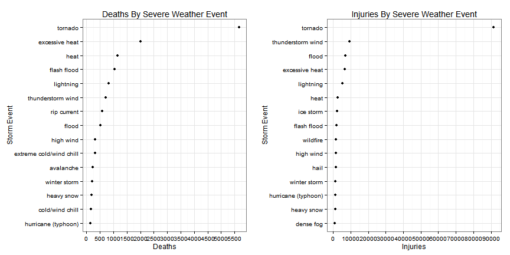
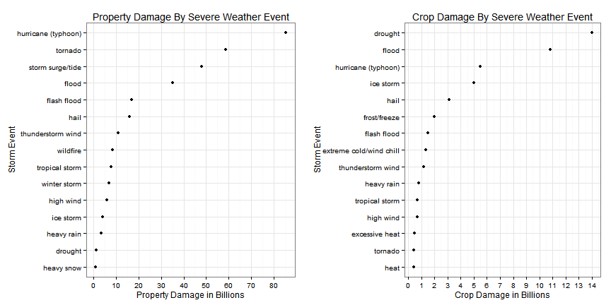

Impact Analysis: Health and Economic Cost of United States Severe Weather Events
===================================================================================

Synopsis
========

The following report attempts to quantify the human and economic costs of severe weather 
events across the United States.  The US National Oceanic and Atmospheric Administration 
(NOAA) database houses storm event data going back to the 1950's. This database includes
counts of fatalities, injuries, property damage and crop damage on significant
US weather events. The following report contains the r code necessary to process and plot
the data, ultimately answering which types of events cause the most fatalities,
injuries, property damage and crop damage.

Briefly, first the data is cleaned and obvious data entry errors are removed. Then,
the data is grouped by storm event type and our metrics of interest are tallied. Finally,
the data is plotted to allow easy observation of the most harmful types of events.

Data Processing
===================================================================================
### Load Packages

```r
suppressMessages(library(dplyr))
suppressMessages(library(ggplot2))
suppressMessages(library(gridExtra))
suppressMessages(library(outliers))
```
### Load Data
Raw data is downloaded and read into R. To make manipulation easier, I transform 
column names to lowercase and put the date variable into a suitable date format.

```r
url <- "https://d396qusza40orc.cloudfront.net/repdata%2Fdata%2FStormData.csv.bz2"
if(!file.exists('repdata-data-StormData.csv.bz2')){
  download.file(url, destfile = 'repdata-data-StormData.csv.bz2')
}
data <- read.csv("repdata-data-StormData.csv.bz2")
names(data) <- tolower(names(data))
data$bgn_date <- as.Date(data$bgn_date, "%m/%d/%Y")
```
### Format Property and Crop Damage Estimates
Property and crop damage estimates are recorded as a numeric value and placeholder
value--K, M, B.  I combine the two for a more interpretable economic cost.


```r
data$property_dmg <- ifelse(data$propdmgexp == "K", data$propdmg * 1e3,
                                 ifelse(data$propdmgexp == "M", data$propdmg * 1e6,
                                        ifelse(data$propdmgexp == "B", data$propdmg * 1e9,
                                               data$propdmg * 0)))

data$crop_dmg <- ifelse(data$cropdmgexp == "K", data$cropdmg * 1e3,
                                 ifelse(data$cropdmgexp == "M", data$cropdmg * 1e6,
                                        ifelse(data$cropdmgexp == "B", data$cropdmg * 1e9,
                                               data$cropdmg * 0)))
```
### Checking For Outliers
An initial check for outliers is always important.  With over 900,000 records,
it is very possible we have data entry errors which could mess with the analysis.
Using the outlier package I identify the values furthest from the mean in each of 
our four categories. 

```r
outliers <- data %>%
  filter(property_dmg == outlier(data$property_dmg)|crop_dmg == outlier(data$crop_dmg)|
           fatalities == outlier(data$fatalities)|injuries == outlier(data$injuries))
outliers%>%
  select(evtype, fatalities, injuries, property_dmg, crop_dmg)
```

```
##        evtype fatalities injuries property_dmg   crop_dmg
## 1     TORNADO         42     1700    250000000          0
## 2 RIVER FLOOD          0        0   5000000000 5000000000
## 3        HEAT        583        0            0          0
## 4   ICE STORM          0        0       500000 5000000000
## 5       FLOOD          0        0 115000000000   32500000
```

```r
as.character(outliers$remarks[5]) #Property Damage outlier statement
```

```
## [1] "Major flooding continued into the early hours of January 1st, before the Napa River finally fell below flood stage and the water receeded. Flooding was severe in Downtown Napa from the Napa Creek and the City and Parks Department was hit with $6 million in damage alone. The City of Napa had 600 homes with moderate damage, 150 damaged businesses with costs of at least $70 million."
```
Examining the records, all the outliers except property damage appear to be legitimate.
Reading the remark for property damage, it appears the value was supposed to be 
~76 million.  The value 115 BILLION is over 1500 times that amount.  The propertydmgexp
was probably incorrectly entered as a 'B' instead of 'M'.  This one value accounts
for 26.9% of property damage done.
I remove it for my analysis.

Note: this outlier detection is easiest to do graphically and I would have done it 
that way had I been allowed more plots.

```r
data <- data%>%
  filter(property_dmg != outlier(data$property_dmg))
```

Now I subset the data set down to the values necessary to answer our questions of 
interest.

```r
data <- data %>%
  select(bgn_date, evtype, fatalities, injuries, property_dmg, crop_dmg)
data$evtype <- tolower(data$evtype)
head(data, n = 2)
```

```
##     bgn_date  evtype fatalities injuries property_dmg crop_dmg
## 1 1950-04-18 tornado          0       15        25000        0
## 2 1950-04-18 tornado          0        0         2500        0
```
### Examining Event Classification Scheme

The current NOAA storm classification scheme consists of 48 distinct event types. However, 
this scheme only went into effect in 1996. Whether to examine the entire data set or
limit my exploration to post-1995 data is a key decision in my analysis.

Limiting to post-1995 data may remove rare, but of significant impact, storm events.  
Examining the full data set may skew certain aspects of the data.  For instance, 
the calculation of damage estimates could vary over time or storm categorization
may vary over time.

A good starting place is to look at the proportion of the damage taking place
before 1996.

```r
pre_1996 <- data %>%
  filter(bgn_date < '1996-01-01')
post_1996 <- data %>%
  filter(bgn_date >= '1996-01-01')
pre_death <- round(sum(pre_1996$fatalities)/sum(data$fatalities) * 100, digits = 1)
pre_injury <- round(sum(pre_1996$injuries)/sum(data$injuries) * 100, digits = 1)
pre_prop <- round(sum(pre_1996$property_dmg)/sum(data$property_dmg) * 100, digits =1)
pre_crop <- round(sum(pre_1996$crop_dmg)/sum(data$crop_dmg) * 100, digits = 1)
```

42.3% and 58.7% of storm deaths and injuries, respectively, took
place prior to 1996. 19.4% and 29.2% of property and crop damage, 
respectively, took place prior to 1996.

If you look at the 5 largest events for our four costs it becomes apparent that while
the majority of economic damage is attributed to storms post-1995, a huge portion of 
the human cost of storms is accounted for by storms prior to 1996.

```r
options(scipen = 20)
data %>%
  select(bgn_date, evtype, fatalities)%>%
  arrange(desc(fatalities))%>%
  top_n(5, fatalities)
data %>%
  select(bgn_date, evtype, injuries)%>%
  arrange(desc(injuries))%>%
  top_n(5, injuries)
data %>%
  select(bgn_date, evtype, property_dmg)%>%
  arrange(desc(property_dmg))%>%
  top_n(5, property_dmg)
data %>%
  select(bgn_date, evtype, crop_dmg)%>%
  arrange(desc(crop_dmg))%>%
  top_n(5, crop_dmg)
```

```
##     bgn_date         evtype fatalities
## 1 1995-07-12           heat        583
## 2 2011-05-22        tornado        158
## 3 1953-06-08        tornado        116
## 4 1953-05-11        tornado        114
## 5 1999-07-28 excessive heat         99
##     bgn_date    evtype injuries
## 1 1979-04-10   tornado     1700
## 2 1994-02-08 ice storm     1568
## 3 1953-06-09   tornado     1228
## 4 1974-04-03   tornado     1150
## 5 2011-05-22   tornado     1150
##     bgn_date            evtype property_dmg
## 1 2005-08-29       storm surge  31300000000
## 2 2005-08-28 hurricane/typhoon  16930000000
## 3 2005-08-29       storm surge  11260000000
## 4 2005-10-24 hurricane/typhoon  10000000000
## 5 2005-08-28 hurricane/typhoon   7350000000
##     bgn_date            evtype   crop_dmg
## 1 1993-08-31       river flood 5000000000
## 2 1994-02-09         ice storm 5000000000
## 3 2005-08-29 hurricane/typhoon 1510000000
## 4 2006-01-01           drought 1000000000
## 5 1998-12-20      extreme cold  596000000
```

Maybe early warning systems have improved post-1995 and there are fewer injuries or 
deaths due to storms.  Maybe the estimation procedure for financial damage has changed
post-1995.  It is pure speculation without more information.  Regardless of the reason,
I believe it is necessary to look at the entire data set.

### Event Type Preprocessing
Next, I have to deal with the huge number of event types present in our data set.

```r
num_evtype <- length(unique(data$evtype))
```
With 898 unique event types, plotting would be unwieldy. More 
importantly, many of these types are data entry errors or different ways of entering 
identical storm events.

My initial approach was to try out R's stringdist package and cluster evtypes based on
string similarity.  Despite a fair amount of tinkering, I could never get a satisfactory
set of clusters.  Manual classification is more work, but seemed to be my best option.

If you look at the top 20 deaths by event type, you immediately see several events 
that probably belong to one category.

```r
data %>%
  group_by(evtype)%>%
  summarise(count = n(), deaths = sum(fatalities), injuries = sum(injuries), 
            prop_dmg = sum(property_dmg), crop_dmg = sum(crop_dmg)) %>%
  arrange(desc(deaths)) %>%
  top_n(20, deaths)
```

```
## Source: local data frame [20 x 6]
## 
##                     evtype  count deaths injuries    prop_dmg   crop_dmg
##                      (chr)  (int)  (dbl)    (dbl)       (dbl)      (dbl)
## 1                  tornado  60652   5633    91346 56925660480  414953110
## 2           excessive heat   1678   1903     6525     7753700  492402000
## 3              flash flood  54277    978     1777 16140811510 1421317100
## 4                     heat    767    937     2100     1797000  401461500
## 5                lightning  15754    816     5230   928659280   12092090
## 6                tstm wind 219942    504     6957  4484958440  554007350
## 7                    flood  25326    470     6789 29657709800 5629468450
## 8              rip current    470    368      232        1000          0
## 9                high wind  20214    248     1137  5270046260  638571300
## 10               avalanche    386    224      170     3721800          0
## 11            winter storm  11433    206     1321  6688497250   26944000
## 12            rip currents    304    204      297      162000          0
## 13               heat wave     75    172      379    10460050    5550000
## 14            extreme cold    657    162      231    67737400 1312973000
## 15       thunderstorm wind  82564    133     1488  3483121140  414843050
## 16              heavy snow  15708    127     1021   932589140  134653100
## 17 extreme cold/wind chill   1002    125       24     8648000      50000
## 18               high surf    734    104      156    89955000          0
## 19             strong wind   3569    103      280   175259450   64953500
## 20                blizzard   2719    101      805   659213950  112060000
```
'tstm wind' and 'thunderstorm wind' or 'extreme cold' and 'extreme cold/wind chill' 
are surely are the same thing. There are many other examples of this as you sift through 
the data set.

```r
unique_events <- data %>%
  group_by(evtype)%>%
  summarise(count = n(), deaths = sum(fatalities), injuries = sum(injuries), 
            prop_dmg = sum(property_dmg), crop_dmg = sum(crop_dmg)) %>%
  filter(deaths > 0 | injuries > 0 | prop_dmg > 0 | crop_dmg > 0)
```
There are 442 unique storm event names where either deaths, injuries, 
property damage or crop damage are greater than 0.  I am manually reclassifying the 
messy event records into as close to the 48 official categories as I can get.


```r
unique_events$evtype <- ifelse(grepl("torn", unique_events$evtype) == TRUE, "tornado", unique_events$evtype)
unique_events$evtype <- ifelse(grepl("avalanc", unique_events$evtype) == TRUE, 
                               "avalanche", unique_events$evtype)
unique_events$evtype <- ifelse(grepl("blizzard", unique_events$evtype) == TRUE,
                               "blizzard", unique_events$evtype)
unique_events$evtype <- ifelse(grepl("coastal|cstl", unique_events$evtype) == TRUE, 
                               "coastal flood", unique_events$evtype)
unique_events$evtype <- ifelse(grepl("cold|low temp", unique_events$evtype) == TRUE & 
           grepl("extreme", unique_events$evtype) == FALSE, "cold/wind chill", unique_events$evtype)
unique_events$evtype <- ifelse(grepl("drought", unique_events$evtype) == TRUE, 
                               "drought", unique_events$evtype)
unique_events$evtype <- ifelse(grepl("dust devil", unique_events$evtype) == TRUE, 
                               "dust devil", unique_events$evtype)
unique_events$evtype <- ifelse(grepl("dust storm", unique_events$evtype) == TRUE, 
                               "dust storm", unique_events$evtype)
unique_events$evtype <- ifelse(grepl("excessive heat|extreme heat|record heat", unique_events$evtype) == TRUE,
         "excessive heat", unique_events$evtype)
unique_events$evtype <- ifelse(grepl("extreme cold|extreme wind|hypothermia", unique_events$evtype) == TRUE,
         "extreme cold/wind chill", unique_events$evtype)
unique_events$evtype <- ifelse(grepl("flash", unique_events$evtype) == TRUE,
                               "flash flood", unique_events$evtype)
unique_events$evtype <- ifelse(grepl("flood|fld", unique_events$evtype) == TRUE & 
                                 grepl("coastal flood|flash flood|lakeshore flood", 
                                       unique_events$evtype) == FALSE, "flood", unique_events$evtype)
unique_events$evtype <- ifelse(grepl("freeze|frost|freezing", unique_events$evtype) == TRUE & 
                                 grepl("freezing fog", unique_events$evtype) == FALSE,
                               "frost/freeze", unique_events$evtype)
unique_events$evtype <- ifelse(grepl("funnel", unique_events$evtype) == TRUE,
                               "funnel cloud", unique_events$evtype)
unique_events$evtype <- ifelse(grepl("hail", unique_events$evtype) == TRUE &
                                 grepl("marine", unique_events$evtype) == FALSE,
                               "hail", unique_events$evtype)
unique_events$evtype <- ifelse(grepl("heat|warm", unique_events$evtype) == TRUE & 
                                 grepl("excessive heat", unique_events$evtype) == FALSE, 
                               "heat", unique_events$evtype)
unique_events$evtype <- ifelse(grepl("heavy|precip", unique_events$evtype) == TRUE &
                                 grepl("snow|surf|swells|seas", unique_events$evtype) == FALSE,
                               "heavy rain", unique_events$evtype)
unique_events$evtype <- ifelse(grepl("heavy|excessive snow|record snow", unique_events$evtype) == TRUE &
                                 grepl("rain|swells|seas", unique_events$evtype) == FALSE,
                               "heavy snow", unique_events$evtype)
unique_events$evtype <- ifelse(grepl("hurricane|typhoon", unique_events$evtype) == TRUE,
                               "hurricane (typhoon)", unique_events$evtype)
unique_events$evtype <- ifelse(grepl("high surf|seas|swells|surf", unique_events$evtype) == TRUE, 
                               "high surf", unique_events$evtype)
unique_events$evtype <- ifelse(grepl("ice|icy", unique_events$evtype) == TRUE,
                               "ice storm", unique_events$evtype)
unique_events$evtype <- ifelse(grepl("lake effect|lake-effect", unique_events$evtype) == TRUE,
                               "lake-effect snow", unique_events$evtype)
unique_events$evtype <- ifelse(grepl("lightning", unique_events$evtype) == TRUE,
                               "lightning", unique_events$evtype)
unique_events$evtype <- ifelse(grepl("marine thunderstorm wind|marine tstm wind", unique_events$evtype) == TRUE,
                               "marine thunderstorm wind",unique_events$evtype)
unique_events$evtype <- ifelse(grepl("rip current", unique_events$evtype) == TRUE,  
                               "rip current", unique_events$evtype)
unique_events$evtype <- ifelse(grepl("sleet", unique_events$evtype) == TRUE, "sleet", unique_events$evtype)
unique_events$evtype <- ifelse(grepl("storm surge", unique_events$evtype) == TRUE,
                               "storm surge/tide", unique_events$evtype)
unique_events$evtype <- ifelse(grepl("strong wind", unique_events$evtype) == TRUE &
                                 grepl("marine|ice", unique_events$evtype) == FALSE,
                               "strong wind", unique_events$evtype)
unique_events$evtype <- ifelse(grepl("thun|tstm|microburst", unique_events$evtype) == TRUE &
                                 grepl("marine|snow|non", unique_events$evtype) == FALSE,
                               "thunderstorm wind", unique_events$evtype)
unique_events$evtype <- ifelse(grepl("tropical storm", unique_events$evtype) == TRUE,
                               "tropical storm", unique_events$evtype)
unique_events$evtype <- ifelse(grepl("waterspout", unique_events$evtype) == TRUE,
                               "waterspout", unique_events$evtype)
unique_events$evtype <- ifelse(grepl("fire", unique_events$evtype) == TRUE,
                               "wildfire", unique_events$evtype)
unique_events$evtype <- ifelse(grepl("winter storm", unique_events$evtype) == TRUE,
                               "winter storm", unique_events$evtype)
unique_events$evtype <- ifelse(grepl("winter weather|wintry|snow|glaze", unique_events$evtype) == TRUE &
                                 grepl("heavy snow|lake-effect snow", unique_events$evtype) == FALSE, 
                               "winter weather", unique_events$evtype)
unique_events$evtype <- ifelse(grepl("fog", unique_events$evtype) == TRUE &
                                 grepl("freezing fog", unique_events$evtype) == FALSE,
                               "dense fog", unique_events$evtype)
unique_events$evtype <- ifelse(grepl("high wind|wind", unique_events$evtype) == TRUE &
                                 grepl("wind chill|marine|strong wind|thunderstorm wind", unique_events$evtype) == FALSE,
                               "high wind", unique_events$evtype)
unique_events$evtype <- ifelse(grepl("slide", unique_events$evtype) == TRUE,
                               "landslide/mudslide", unique_events$evtype)

unique_events <- unique_events %>%
  group_by(evtype)%>%
  summarise(count = n(), deaths = sum(deaths), injuries = sum(injuries), 
            prop_dmg = sum(prop_dmg), crop_dmg = sum(crop_dmg)) %>%
  arrange(desc(deaths))
unique(unique_events$evtype)
```

```
##  [1] "tornado"                  "excessive heat"          
##  [3] "heat"                     "flash flood"             
##  [5] "lightning"                "thunderstorm wind"       
##  [7] "rip current"              "flood"                   
##  [9] "high wind"                "extreme cold/wind chill" 
## [11] "avalanche"                "winter storm"            
## [13] "heavy snow"               "cold/wind chill"         
## [15] "hurricane (typhoon)"      "high surf"               
## [17] "strong wind"              "ice storm"               
## [19] "blizzard"                 "heavy rain"              
## [21] "wildfire"                 "winter weather"          
## [23] "dense fog"                "tropical storm"          
## [25] "landslide/mudslide"       "tsunami"                 
## [27] "storm surge/tide"         "dust storm"              
## [29] "hail"                     "marine thunderstorm wind"
## [31] "marine strong wind"       "frost/freeze"            
## [33] "coastal flood"            "marine mishap"           
## [35] "drought"                  "high water"              
## [37] "waterspout"               "dust devil"              
## [39] "excessive rainfall"       "sleet"                   
## [41] "drowning"                 "high waves"              
## [43] "hyperthermia/exposure"    "marine accident"         
## [45] "marine high wind"         "rapidly rising water"    
## [47] "?"                        "apache county"           
## [49] "astronomical high tide"   "astronomical low tide"   
## [51] "beach erosion"            "blowing dust"            
## [53] "cool and wet"             "dam break"               
## [55] "dense smoke"              "downburst"               
## [57] "excessive wetness"        "freezing fog"            
## [59] "funnel cloud"             "gustnado"                
## [61] "high"                     "hvy rain"                
## [63] "lake-effect snow"         "lakeshore flood"         
## [65] "landslump"                "landspout"               
## [67] "lighting"                 "ligntning"               
## [69] "marine hail"              "other"                   
## [71] "rain"                     "rainstorm"               
## [73] "record rainfall"          "rogue wave"              
## [75] "seiche"                   "severe turbulence"       
## [77] "torrential rainfall"      "tropical depression"     
## [79] "urban and small"          "urban small"             
## [81] "urban/small stream"       "volcanic ash"
```
Now I am down to 82 unique events.  The events 
not in official categories were too ambiguous to confidently place into a category. 
Luckily, those event types make up an insignificant portion of the data.

Results
===================================================================================
### Fatality and Injury Data by Event Type

With the hard work out of the way, now I can easily view the results using ggplot2.
For each plot I subset to the needed columns and then select the top 15 events.

```r
deaths <- unique_events %>% 
  select(evtype, deaths)%>%
  top_n(15, deaths)

p1 <- ggplot(data = deaths, aes(x = reorder(evtype, deaths), y = deaths))+
  geom_point()+
  scale_y_continuous(breaks = seq(0, 6000, by = 500))+
  coord_flip()+
  theme_bw()+
  xlab("Storm Event")+
  ylab("Deaths")+
  ggtitle("Deaths By Severe Weather Event")

injuries <- unique_events %>%
  select(evtype, injuries)%>%
  top_n(15, injuries)

p2 <- ggplot(data = injuries, aes(x = reorder(evtype, injuries), y = injuries))+
  geom_point()+
  scale_y_continuous(breaks = seq(0, 92000, by = 10000))+
  coord_flip()+
  theme_bw()+
  xlab("Storm Event")+
  ylab("Injuries")+
  ggtitle("Injuries By Severe Weather Event")

grid.arrange(p1, p2, ncol = 2)
```

 

Tornados are far and away the most harmful events with respect to population health.
They are responsible for over 5,500 deaths and over 90,000 injuries. In general, wind
related events are heavily represented for both deaths and injuries. Heat related deaths 
are also very prevalent according to our data.

### Economic Impact Data by Event Type

```r
property <- unique_events %>%
  select(evtype, prop_dmg)%>%
  top_n(15, prop_dmg)

p3 <- ggplot(data = property, aes(x = reorder(evtype, prop_dmg), y = prop_dmg/1000000000))+
  scale_y_continuous(breaks = seq(0, 150, by = 10))+
  geom_point()+
  coord_flip()+
  theme_bw()+
  xlab("Storm Event")+
  ylab("Property Damage in Billions")+
  ggtitle("Property Damage By Severe Weather Event")

crop <- unique_events %>%
  select(evtype, crop_dmg)%>%
  arrange(desc(crop_dmg))%>%
  top_n(15, crop_dmg)

p4 <- ggplot(data = crop, aes(x = reorder(evtype, crop_dmg), y = crop_dmg/1000000000))+
  scale_y_continuous(breaks = seq(0, 15, by = 1))+
  geom_point()+
  coord_flip()+
  theme_bw()+
  xlab("Storm Event")+
  ylab("Crop Damage in Billions")+
  ggtitle("Crop Damage By Severe Weather Event")

grid.arrange(p3, p4, ncol = 2)
```

 
Hurricanes have caused the most property damage at over 80 billion dollars with tornadoes
and storm surges both causing over 40 billion dollars in damage.

Crop damage results make intuitive sense with drought and flood events totalling
50.5% of 
the total damage with ~14 billion and ~11 billion dollars respectively.  


